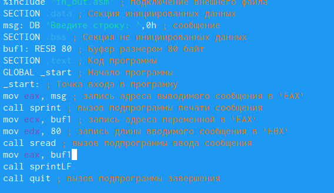

---
## Front matter
title: "Отчёт по лабораторной работе №5"
author: "Цатурьян Лев Вячеславович НММбд-03-23"

## Generic otions
lang: ru-RU
toc-title: "Содержание"

## Bibliography
bibliography: bib/cite.bib
csl: pandoc/csl/gost-r-7-0-5-2008-numeric.csl

## Pdf output format
toc: true # Table of contents
toc-depth: 2
lof: true # List of figures
fontsize: 12pt
linestretch: 1.5
papersize: a4
documentclass: scrreprt
## I18n polyglossia
polyglossia-lang:
  name: russian
  options:
	- spelling=modern
	- babelshorthands=true
polyglossia-otherlangs:
  name: english
## I18n babel
babel-lang: russian
babel-otherlangs: english
## Fonts
mainfont: PT Serif
romanfont: PT Serif
sansfont: PT Sans
monofont: PT Mono
mainfontoptions: Ligatures=TeX
romanfontoptions: Ligatures=TeX
sansfontoptions: Ligatures=TeX,Scale=MatchLowercase
monofontoptions: Scale=MatchLowercase,Scale=0.9
## Biblatex
biblatex: true
biblio-style: "gost-numeric"
biblatexoptions:
  - parentracker=true
  - backend=biber
  - hyperref=auto
  - language=auto
  - autolang=other*
  - citestyle=gost-numeric
## Pandoc-crossref LaTeX customization
figureTitle: "Рис."
tableTitle: "Таблица"
listingTitle: "Листинг"
lofTitle: "Список иллюстраций"
lolTitle: "Листинги"
## Misc options
indent: true
header-includes:
  - \usepackage{indentfirst}
  - \usepackage{float} # keep figures where there are in the text
  - \floatplacement{figure}{H} # keep figures where there are in the text
---

# Цель работы

Обучение работе с Midnight commander. Освоение инструкций mov и int.

# Выполнение лабораторной работы

После открытия терминала я ввел команду mc, тем самым открыв Midnight commander.
Перешел в каталог ~/work/arch-pc и создал в нем новую папку lab 5 с помощью клавиши f7

{#fig:001 width=70%}

После этого я создал файл lab5-1.asm в этой папке с помощью команды touch

{#fig:001 width=70%}

Затем я открыл этот файл с помощью клавиши f4 и ввел в него текст из листинга 5.1

{#fig:001 width=70%}

Далее я открыл этот файл с помощью клавиши f3 (просмотр) и убедился, что все выполнено верно

{#fig:001 width=70%}

{#fig:001 width=70%}

{#fig:001 width=70%}

Дальше я скачал файл с подпрограммами с курса в ТУИС
Необходимо, чтобы файл с подпрограммами находился в директории, в которой ведется работа

{#fig:001 width=70%}

{#fig:001 width=70%}

После этого я вставил в созданную копию файла текст из листинга 5.2

{#fig:001 width=70%}

Строка ввода находится на строку ниже строки запроса из-за подпрограммы sprintLF

{#fig:001 width=70%}

{#fig:001 width=70%}

Теперь введенные данные находятся на той же строке, что и запрос

#Задание для самостоятельной работы

Сначала я создал копию файла lab5-1.asm с помощью клавиши F5

{#fig:001 width=70%}

Затем с помощью клвиши F4(правка) в открывшемся файле я внес изменения.
Добавил значение 4 в регистр eax
Ввел дескриптор файла в регистр ebx (вывод на экран)
Ввел адрес переменной, в которую записываются воодимые пользователем данные
задал длину строки в регистре edx

{#fig:001 width=70%}

С помощью команд nasm -f elf и ld -m elf_i386 создал объектный и исполняемый файлы
Запустил получившуюся программу

{#fig:001 width=70%}

{#fig:001 width=70%}

После этого нужно было добиться такого же результата, но с использованием подпрограмм из ранее скачанного файла
 
{#fig:001 width=70%}

{#fig:001 width=70%}

Здесь также задается переменная, в которую было помещено введенное пользователем значение, после чего написана команда call sprintLF, чтобы введенные данные отображались на экране с новой строки

{#fig:001 width=70%}

{#fig:001 width=70%}

Все работает корректно, введенные данные выводятся с новой строки (из-за команды sprintLF)

# Выводы

Получены навыки работы с Midnight commander. Освоены инструкции mov и int.

