---
## Front matter
title: "Отчёт по лабораторной работе №6"
author: "Цатурьян Лев Вячеславович НММбд-03-23"

## Generic otions
lang: ru-RU
toc-title: "Содержание"

## Bibliography
bibliography: bib/cite.bib
csl: pandoc/csl/gost-r-7-0-5-2008-numeric.csl

## Pdf output format
toc: true # Table of contents
toc-depth: 2
lof: true # List of figures
fontsize: 12pt
linestretch: 1.5
papersize: a4
documentclass: scrreprt
## I18n polyglossia
polyglossia-lang:
  name: russian
  options:
	- spelling=modern
	- babelshorthands=true
polyglossia-otherlangs:
  name: english
## I18n babel
babel-lang: russian
babel-otherlangs: english
## Fonts
mainfont: PT Serif
romanfont: PT Serif
sansfont: PT Sans
monofont: PT Mono
mainfontoptions: Ligatures=TeX
romanfontoptions: Ligatures=TeX
sansfontoptions: Ligatures=TeX,Scale=MatchLowercase
monofontoptions: Scale=MatchLowercase,Scale=0.9
## Biblatex
biblatex: true
biblio-style: "gost-numeric"
biblatexoptions:
  - parentracker=true
  - backend=biber
  - hyperref=auto
  - language=auto
  - autolang=other*
  - citestyle=gost-numeric
## Pandoc-crossref LaTeX customization
figureTitle: "Рис."
tableTitle: "Таблица"
listingTitle: "Листинг"
lofTitle: "Список иллюстраций"
lolTitle: "Листинги"
## Misc options
indent: true
header-includes:
  - \usepackage{indentfirst}
  - \usepackage{float} # keep figures where there are in the text
  - \floatplacement{figure}{H} # keep figures where there are in the text
---

# Цель работы

Получение навыков работы с арифметическими инструкциями языка ассемблера NASM.

# Выполнение лабораторной работы

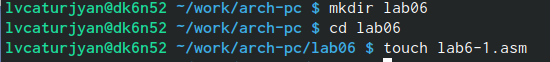{#fig:001 width=70%}

Далее я ввёл в созданный файл текст листинга 6.1

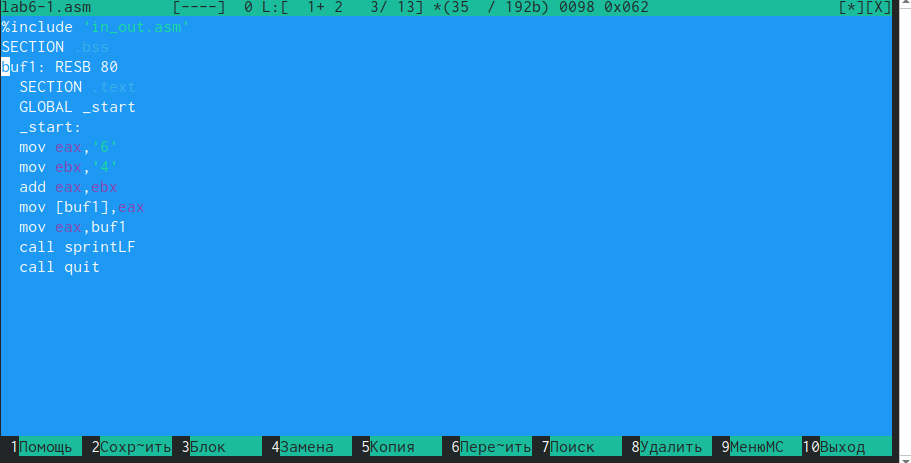{#fig:001 width=70%}

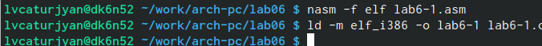{#fig:001 width=70%}

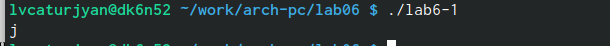{#fig:001 width=70%}

На экран вывелся символ j, так как команда add записала в eax сумму двоичных кодов цифр 6 и 4, что в свою очередб является кодом символа j 

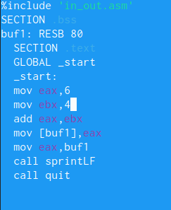{#fig:001 width=70%}

Вместо символов мы уже записали числа
Теперь создадим объектный и исполняемый файлы и запустим программу

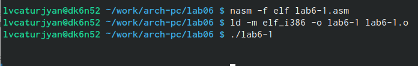{#fig:001 width=70%}

На экран ничего не вывелось, это произошло потому, что код элемента 10 соответствует символу перевода строки

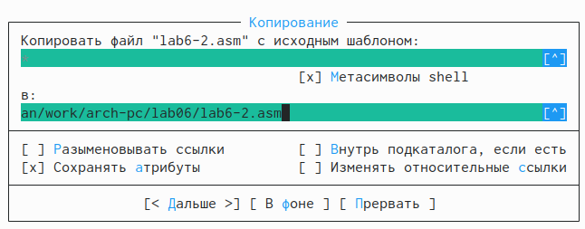{#fig:001 width=70%}

В этот файл я вставил текст из листинга 6.2

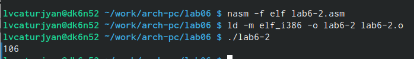{#fig:001 width=70%}
Вывелось число 106 из-за функции iprintLF

Далее я изменил символы на числа в тексте этого файла

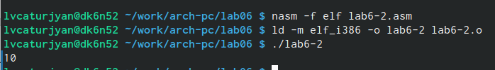{#fig:001 width=70%}

Наконец вывелось число 10, это произошло потому, что программа теперь считает цифры 6 и 4 за числа, а не за символы

Далее я изменил команду iprintLF на iprint, теперь результат не должен выводиться на следующей строке

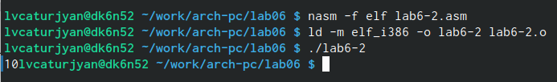{#fig:001 width=70%}

Ожидания подтвердились, ответ выводится на той же строке

Далее я создал файл lab6-3 и вставил в него текст из листинга 6.3 

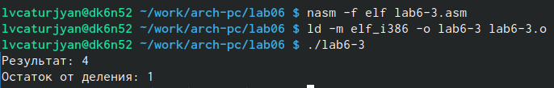{#fig:001 width=70%}

Ответ верен, программа работает корректно

После этого я изменил текст программы для вычисления выражения f(𝑥) = (4 ∗ 6 + 2)/5.

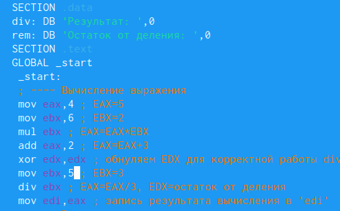{#fig:001 width=70%}

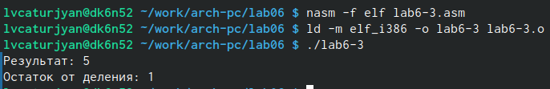{#fig:001 width=70%}

Результат верный, программа работает правильно

Далее я создал файл variant.asm, чтобы выполнить следующее задание, и вставил в него текст из листинга 6.4
 
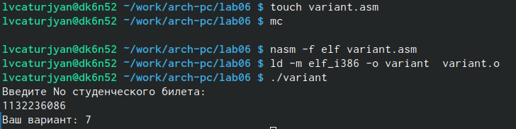{#fig:001 width=70%}

На запрос ввёл номер своего студенческого билета, после этого вычислил номер вручную, мой ответ совпал с результатом программы. Мой вариант: 7

Ответы на вопросы:
1) За вывод строки Ваш вариант отвечают строки:
mov eax,rem
call sprint
2) mov ecx,x используется для записи адреса вводимой строки х в регистр ecx,
mov edx,80 запись в регистр edx длины вводимой строки
call spread вызов подпрограммы для ввода значений с клавиатуры
3) call atoi - вызов подпрограммы из внешнего файла, преобразующей ascii код символа в число, и записывает его в eax
4) xor edx,edx
mov ebx,20
div ebx
inc edx
эти строки отвечают за вычисление варианта
5)При выполнении div ebx остаток от деления записывается в edx
6)Инструкция inc edx увеличивает значение в регистре edx на 1
7) За вывод на экран результата вычисления отвечают строки
mov eax,edx
call iprintLF

# Задание для самостоятельной работы

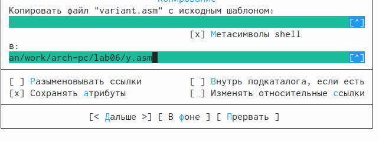{#fig:001 width=70%}

Мой вариант 7, поэтому я пишу программу для вычисления функции y=5(x-1)^2

{#fig:001 width=70%}
dec eax - уменьшение значения в eax(регистр с переменной) на 1
mul eax - умножение значения в eax на себя же (возведение в квадрат)
mov ebx,5 - запись числа 5 в ebx
mul ebx - умножение на 5
mov edi,eax - запись результата в edi

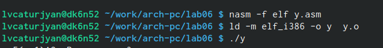{#fig:001 width=70%}

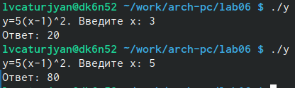{#fig:001 width=70%}

# Выводы
Я освоил арифметические инструкции языка ассемблера NASM
