---
## Front matter
title: "Отчёт по лабораторной работе №7"
author: "Цатурьян Лев Вячеславович НММбд-03-23"

## Generic otions
lang: ru-RU
toc-title: "Содержание"

## Bibliography
bibliography: bib/cite.bib
csl: pandoc/csl/gost-r-7-0-5-2008-numeric.csl

## Pdf output format
toc: true # Table of contents
toc-depth: 2
lof: true # List of figures
fontsize: 12pt
linestretch: 1.5
papersize: a4
documentclass: scrreprt
## I18n polyglossia
polyglossia-lang:
  name: russian
  options:
	- spelling=modern
	- babelshorthands=true
polyglossia-otherlangs:
  name: english
## I18n babel
babel-lang: russian
babel-otherlangs: english
## Fonts
mainfont: PT Serif
romanfont: PT Serif
sansfont: PT Sans
monofont: PT Mono
mainfontoptions: Ligatures=TeX
romanfontoptions: Ligatures=TeX
sansfontoptions: Ligatures=TeX,Scale=MatchLowercase
monofontoptions: Scale=MatchLowercase,Scale=0.9
## Biblatex
biblatex: true
biblio-style: "gost-numeric"
biblatexoptions:
  - parentracker=true
  - backend=biber
  - hyperref=auto
  - language=auto
  - autolang=other*
  - citestyle=gost-numeric
## Pandoc-crossref LaTeX customization
figureTitle: "Рис."
tableTitle: "Таблица"
listingTitle: "Листинг"
lofTitle: "Список иллюстраций"
lolTitle: "Листинги"
## Misc options
indent: true
header-includes:
  - \usepackage{indentfirst}
  - \usepackage{float} # keep figures where there are in the text
  - \floatplacement{figure}{H} # keep figures where there are in the text
---

# Цель работы

Получение навыков написания программ с использованием переходов. Изучение структуры файла листинга

# Выполнение лабораторной работы

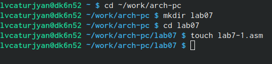{#fig:001 width=70%}

Далее я ввёл в созданный файл текст листинга 7.1, создал объектный и исполняемый файлы

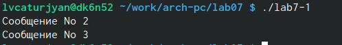{#fig:001 width=70%}

Сначала выводится сообщение 2, потом 3

Далее я изменил текст программы таким образом, чтобы программа выводила сначала второе, потом первое сообщение
Для этого я добавил инструкцию jmp с меткой _label1 (т.е. переход к инструкциям вывода сообщения № 1),  и инструкцию jmp с меткой _end (т.е. переход к инструкции call quit)

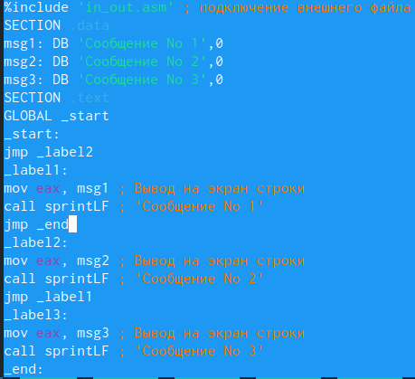{#fig:001 width=70%}

Теперь создадим объектный и исполняемый файлы и запустим программу

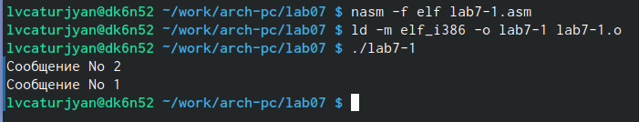{#fig:001 width=70%}

Теперь сначала выводится второе сообщение, затем первое

Теперь нужно задать такой порядок вывода сообщений : 3,2,1
Для этого я перешел в midnight commander и изменил текст следующим образом:

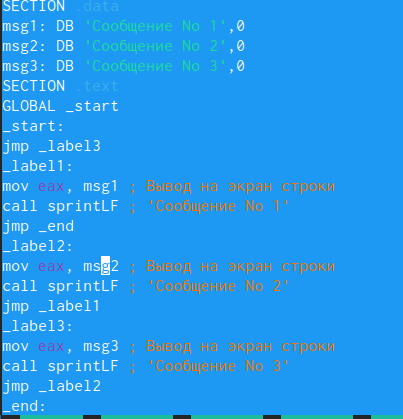{#fig:001 width=70%}

В самом начале стоит метка, отсылающая к выводу сообщения 3, после этого стоит метка на сообщение 2, после этого - на 1, и метка перехода к инструкции call quit

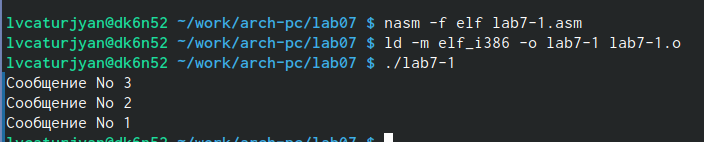{#fig:001 width=70%}

Все работает корректно

Далее я создал файл lab7-2.asm и ввел в него текст из листинга 7.3

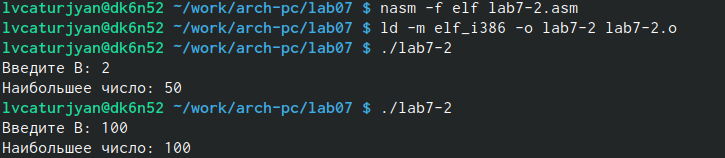{#fig:001 width=70%}

Протестировал работу программы разными числами, все работает правильно

После этого я создал файл листинга с помощью ключа -l

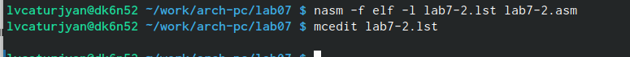{#fig:001 width=70%}

После этого я открыл этот файл в текстовом редакторе и изучил его структуру

{#fig:001 width=70%}

Первая строка: 17 - номер строки, 000000F2 адрес, B9[0A000000] машинный код, mov ecx, B исходный текст программы
Вторая строка: 18 - номер строки, 000000F7 адрес, BA0A000000 машинный код, mov edx, 10 исходный текст программы
Третья строка: 19 - номер строки, 000000FC адрес, E842FFFFFF машинный код, call spread исходный текст программы

После этого я удалил один операнд из инструкции в файле lab7-2.asm и транслировал его в файл листинга

{#fig:001 width=70%}

На месте убранного операнда возникла строка ошибки, новых файлов не создалось

# Задание для самостоятельной работы
# Задание 1
Мой вариант из прошлой лабораторной работы - 7

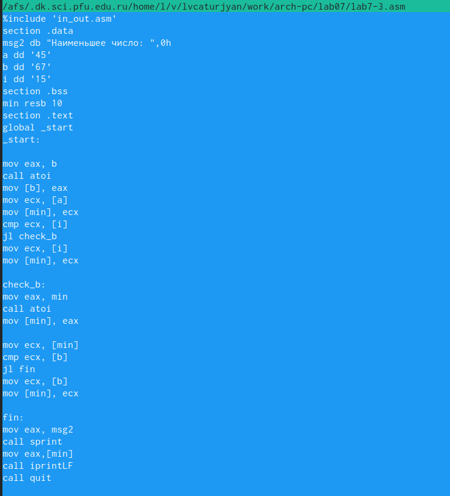{#fig:001 width=70%}

Её листинг:

%include 'in_out.asm'
section .data
msg2 db "Наименьшее число: ",0h
a dd '45'
b dd '67'
i dd '15'
section .bss
min resb 10
section .text
global _start
_start:

mov eax, b
call atoi
mov [b], eax
mov ecx, [a]
mov [min], ecx
cmp ecx, [i] 
jl check_b
mov ecx, [i]
mov [min], ecx

check_b:
mov eax, min
call atoi
mov [min], eax

mov ecx, [min]
cmp ecx, [b]
jl fin
mov ecx, [b]
mov [min], ecx

fin:
mov eax, msg2
call sprint 
mov eax,[min]
call iprintLF
call quit 
 
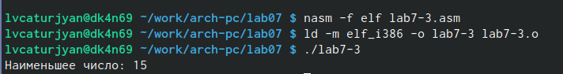{#fig:001 width=70%}

Программа работает корректно даже если переставить значения переменных

# Задание 2
Моя программа сравнивает значения двух вводимых пользователем чисел, после чего
1) Если числа совпадает, первое число умножается на 6 и выводится на экран
2) Если числа не совпадают, то на экран выводится их сумма

Листинг этой программы:
%include 'in_out.asm' 
SECTION .data
msg: DB 'Введите x: ',0
aff: DB 'Введите a: ',0
SECTION .bss
x: RESB 80
a: RESB 80
SECTION .text
GLOBAL _start
_start:

mov eax, msg
call sprint

mov ecx, x
mov edx, 80
call sread

mov eax, x 
call atoi 
mov [x], eax

mov eax, aff 
call sprint

mov ecx, a
mov edx, 80
call sread

mov eax, a
call atoi
mov [a], eax

mov ebx, [x]
cmp [a],ebx

je check
mov eax, [a]
mov ebx, [x]
add eax, ebx
call iprintLF  
jmp fin

check:
mov eax, [a]
mov ebx, 6
mul ebx
call iprintLF
fin:
call quit

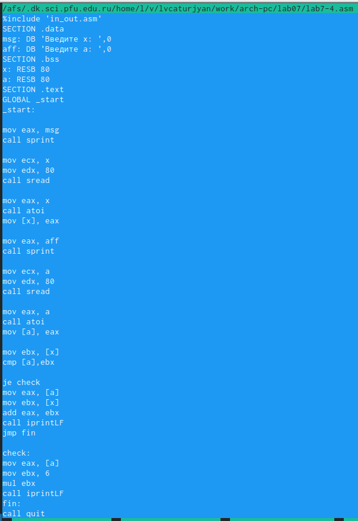{#fig:001 width=70%}

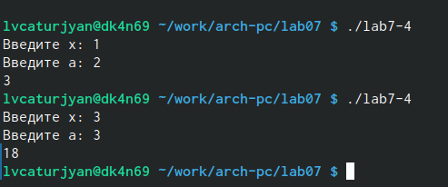{#fig:001 width=70%}

# Выводы
Я получил навыки написания программ с использованием переходов. Ознакомился со структурой файла листинга
