---
## Front matter
title: "Отчёт по лабораторной работе №8"
author: "Цатурьян Лев Вячеславович НММбд-03-23"

## Generic otions
lang: ru-RU
toc-title: "Содержание"

## Bibliography
bibliography: bib/cite.bib
csl: pandoc/csl/gost-r-7-0-5-2008-numeric.csl

## Pdf output format
toc: true # Table of contents
toc-depth: 2
lof: true # List of figures
fontsize: 12pt
linestretch: 1.5
papersize: a4
documentclass: scrreprt
## I18n polyglossia
polyglossia-lang:
  name: russian
  options:
	- spelling=modern
	- babelshorthands=true
polyglossia-otherlangs:
  name: english
## I18n babel
babel-lang: russian
babel-otherlangs: english
## Fonts
mainfont: PT Serif
romanfont: PT Serif
sansfont: PT Sans
monofont: PT Mono
mainfontoptions: Ligatures=TeX
romanfontoptions: Ligatures=TeX
sansfontoptions: Ligatures=TeX,Scale=MatchLowercase
monofontoptions: Scale=MatchLowercase,Scale=0.9
## Biblatex
biblatex: true
biblio-style: "gost-numeric"
biblatexoptions:
  - parentracker=true
  - backend=biber
  - hyperref=auto
  - language=auto
  - autolang=other*
  - citestyle=gost-numeric
## Pandoc-crossref LaTeX customization
figureTitle: "Рис."
tableTitle: "Таблица"
listingTitle: "Листинг"
lofTitle: "Список иллюстраций"
lolTitle: "Листинги"
## Misc options
indent: true
header-includes:
  - \usepackage{indentfirst}
  - \usepackage{float} # keep figures where there are in the text
  - \floatplacement{figure}{H} # keep figures where there are in the text
---

# Цель работы

Приобретение навыков написания программ с использованием циклов, работа со стеками.

# Выполнение лабораторной работы

Сначала я создал каталог для программам лабораторной работы № 8, перешёл в него и создал
файл lab8-1.asm:
Далее я ввёл в созданный файл текст листинга 8.1, создал объектный и исполняемый файлы

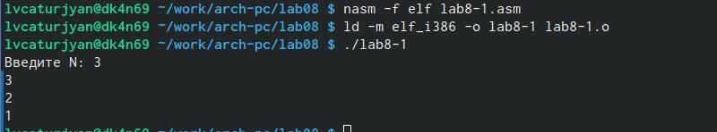{#fig:001 width=70%}

Программа работает некорректно

Далее я изменил текст программы добавив изменение
значение регистра ecx в цикле
Для этого я добавил команду sub ecx,1

Далее я создал объектный и исполняемый файлы и запустил программу

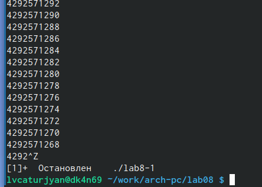{#fig:001 width=70%}

Регистр ecx принимает бесконечно много значений, так как из него каждый раз вычитается единица
Число проходов цикла не соответствует значению ввёденному с клавиатуры

Далее я изменил текст программы, добавив команды push и pop (добавление в стек и извлечение из стека)

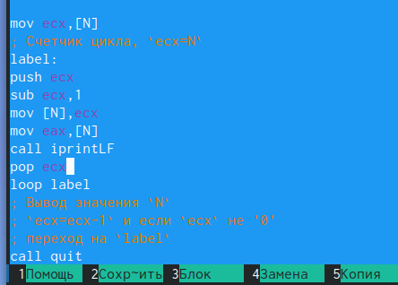{#fig:001 width=70%}

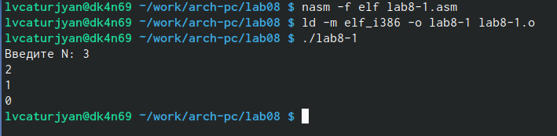{#fig:001 width=70%}

Все работает корректно

Далее я создал файл lab8-2.asm и ввёл в него текст из листинга 8.2

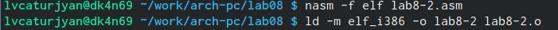{#fig:001 width=70%}
{#fig:001 width=70%}

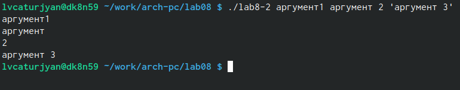{#fig:001 width=70%}

Команда обработала 4 аргумента и вывела каждый из них на отдельной строке

После этого я создал файл lab8-3.asm и ввел в него текст из листинга 8.3

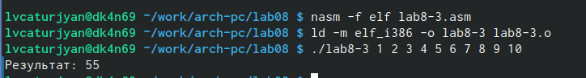{#fig:001 width=70%}

Результат я проверил вручную. Программа работает правильно

Далее мне потребовалось изменить текст файла так, чтобы вычислялось произведение аргументов

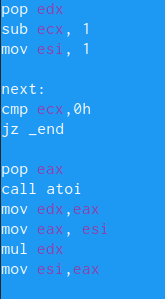{#fig:001 width=70%}

Вместо значения 0 в регистре esi теперь значение 1 - это нужно, чтобы результат умножения был отличен от нуля
Остальные добавленные мной команды умножают значение в регистре esi на введённый аргумент 

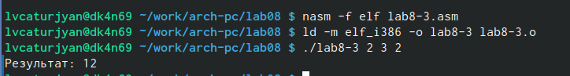{#fig:001 width=70%}

Программа работает правильно

# Задание для самостоятельной работы

Мой вариант из прошлой лабораторной работы - 7

Моя программа подставляет введённые пользователем значения аргументов в функцию, запоминает значения функции от каждого аргумента и суммирует их

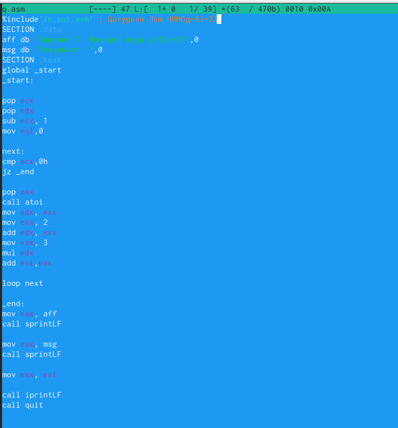{#fig:001 width=70%}

Её листинг:

%include'in_out.asm' ; Цатурьян Лев НММбд-03-23
SECTION .data
aff db "Вариант 7. Функция вида y=3(x+2)",0
msg db "Результат: ",0
SECTION .text
global _start
_start:

pop ecx
pop edx
sub ecx, 1
mov esi,0

next:
cmp ecx,0h
jz _end

pop eax
call atoi
mov edx, eax
mov eax, 2
add edx, eax
mov eax, 3
mul edx
add esi,eax

loop next

_end:
mov eax, aff
call sprintLF

mov eax, msg
call sprintLF

mov eax, esi

call iprintLF
call quit

Программа извлекает значение аргумента из стека, выполняет над ним арифметические операции, после чего прибавляет полученное значение к регистру промежуточных сумм (esi), с помощью цикла loop эти действия повторяются, пока не кончатся аргументы

Далее я создал объектный и исполняемый файлы и запустил программу, вводя разные значения аргументов

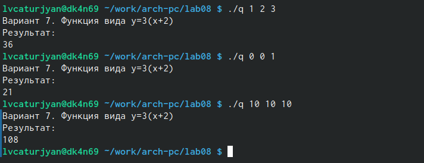{#fig:001 width=70%}

Программа работает корректно, результаты вычислений были проверены мной вручную

# Выводы
Я приобрёл навыки использования циклов в программе
