---
## Front matter
title: "Отчёт по лабораторной работе №9"
author: "Цатурьян Лев Вячеславович НММбд-03-23"

## Generic otions
lang: ru-RU
toc-title: "Содержание"

## Bibliography
bibliography: bib/cite.bib
csl: pandoc/csl/gost-r-7-0-5-2008-numeric.csl

## Pdf output format
toc: true # Table of contents
toc-depth: 2
lof: true # List of figures
fontsize: 12pt
linestretch: 1.5
papersize: a4
documentclass: scrreprt
## I18n polyglossia
polyglossia-lang:
  name: russian
  options:
	- spelling=modern
	- babelshorthands=true
polyglossia-otherlangs:
  name: english
## I18n babel
babel-lang: russian
babel-otherlangs: english
## Fonts
mainfont: PT Serif
romanfont: PT Serif
sansfont: PT Sans
monofont: PT Mono
mainfontoptions: Ligatures=TeX
romanfontoptions: Ligatures=TeX
sansfontoptions: Ligatures=TeX,Scale=MatchLowercase
monofontoptions: Scale=MatchLowercase,Scale=0.9
## Biblatex
biblatex: true
biblio-style: "gost-numeric"
biblatexoptions:
  - parentracker=true
  - backend=biber
  - hyperref=auto
  - language=auto
  - autolang=other*
  - citestyle=gost-numeric
## Pandoc-crossref LaTeX customization
figureTitle: "Рис."
tableTitle: "Таблица"
listingTitle: "Листинг"
lofTitle: "Список иллюстраций"
lolTitle: "Листинги"
## Misc options
indent: true
header-includes:
  - \usepackage{indentfirst}
  - \usepackage{float} # keep figures where there are in the text
  - \floatplacement{figure}{H} # keep figures where there are in the text
---

# Цель работы

Приобретение навыков использования подпрограмм. Работа с отладчиком

# Выполнение лабораторной работы

Сначала я создал каталог для программам лабораторной работы № 9, перешёл в него и создал
файл lab9-1.asm:
Далее я ввёл в созданный файл текст листинга 9.1, создал объектный и исполняемый файлы

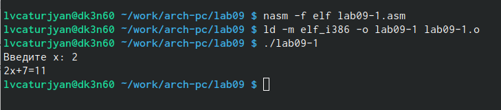{#fig:001 width=70%}

Далее я изменил текст программы добавив подпрограмму subcalcul

Далее я создал объектный и исполняемый файлы и запустил программу

{#fig:001 width=70%}

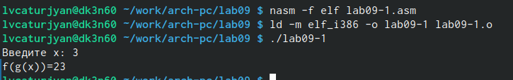{#fig:001 width=70%}

Все работает корректно

Далее я создал файл lab9-2.asm и ввёл в него текст из листинга 9.2 и транслировал этот файл с ключом -g

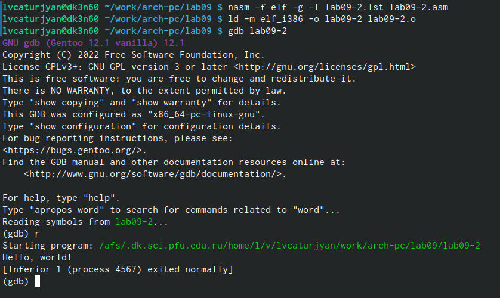{#fig:001 width=70%}

Я запустил программу с помощью run

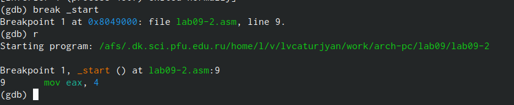{#fig:001 width=70%}

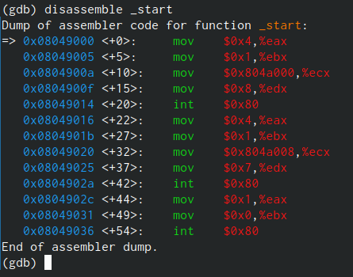{#fig:001 width=70%}

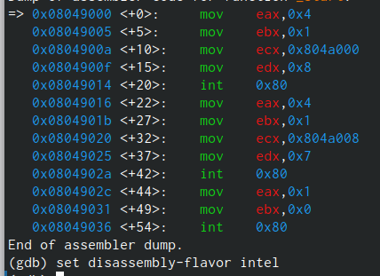{#fig:001 width=70%}

Различия состоят в том, что в дисассимилированном отображении вместо названия регистров пишутся их адреса

Затем я включил режим псевдографики

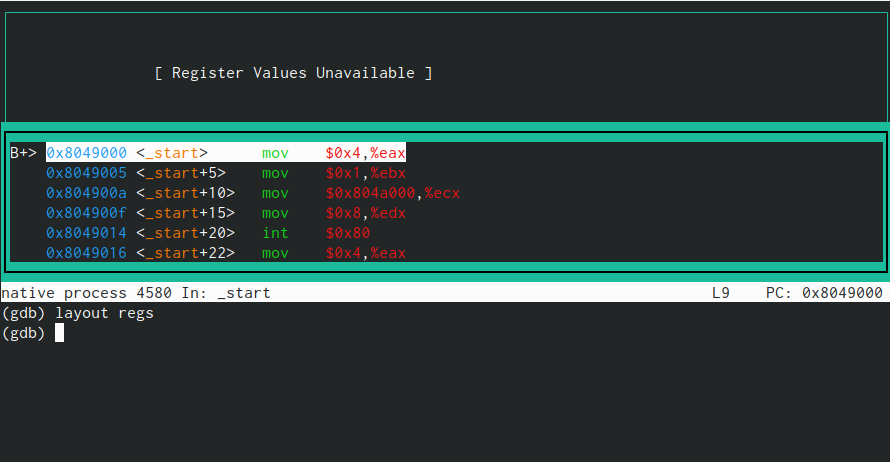{#fig:001 width=70%}

Далее я проверил наличие точек останова в программе с помощью info breakpoints

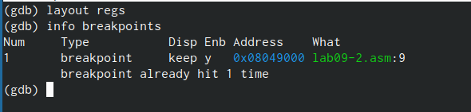{#fig:001 width=70%}

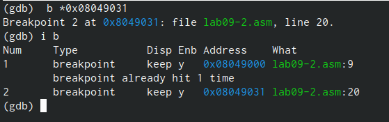{#fig:001 width=70%}

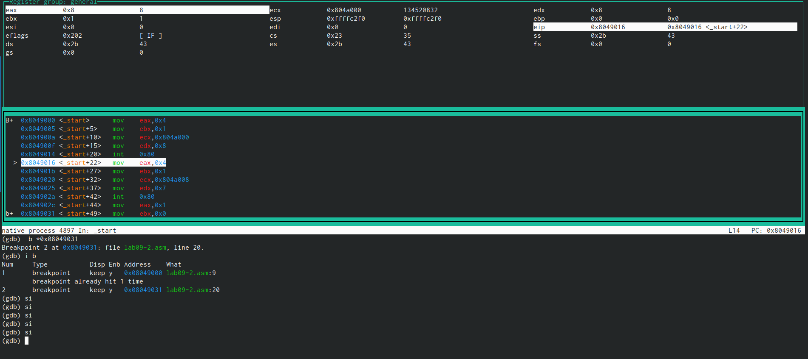{#fig:001 width=70%}

Команда si последовательно выполняет шаги программы, после 5 таких команд изменились значения регистров eax,ebx,ecx,edx

Далее я посмотрел значение переменной msg1 по имени

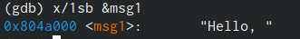{#fig:001 width=70%}

В ней находится слово Hello и знак ,

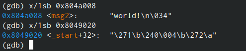{#fig:001 width=70%}

В ней слово world

Далее я изменил букву H на h в msg1

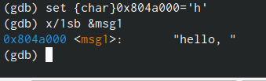{#fig:001 width=70%}

Такую же операцию я проделал с символом w в msg2 

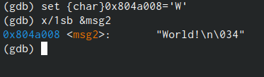{#fig:001 width=70%}

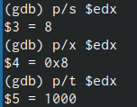{#fig:001 width=70%}

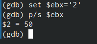{#fig:001 width=70%}

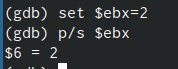{#fig:001 width=70%}

Разница в том, что в первом случае '2' - это символ, а 2 - это число

После этого я завершил выполнение программы с помощью с и вышел из отладчика с помощью quit

Далее я скопировал файл lab8-2.asm и назвал его lab9-3.asm, создал и загрузил исполняемый файл в отладчик, указав аргументы

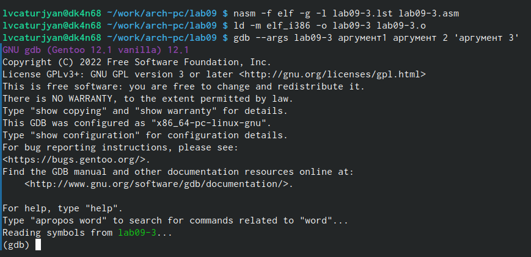{#fig:001 width=70%}

Далее я задал точку останова перед start и просмотрел позиции стека, в которых находятся аргументы

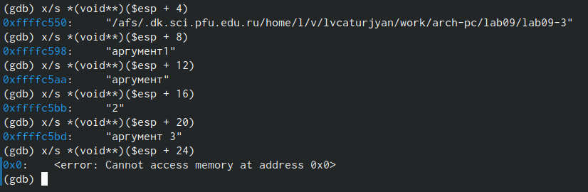{#fig:001 width=70%}

Значение меняется на 4, потому что именно на столько байт смещен каждый элемент относительно вершины стека

# Задание для самостоятельной работы

# Задание 1

Это измененная версия программы из лабораторной работы 8, теперь вычисление значения функции 𝑓(𝑥) происходит как подпрограмма

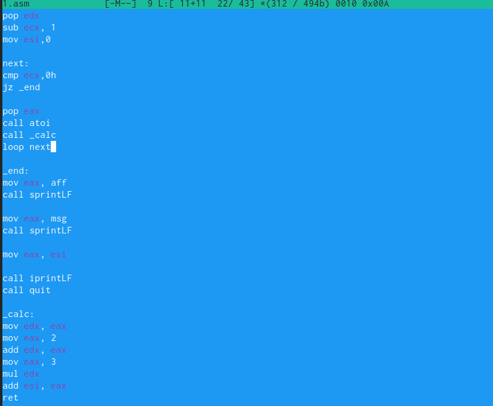{#fig:001 width=70%}

Её листинг:

%include'in_out.asm' ; Цатурьян Лев НММбд-03-23
SECTION .data
aff db "Вариант 7. Функция вида y=3(x+2)",0
msg db "Результат: ",0
SECTION .text
global _start
_start:

pop ecx
pop edx
sub ecx, 1
mov esi,0

next:
cmp ecx,0h
jz _end

pop eax
call atoi
call _calc
loop next

_end:
mov eax, aff
call sprintLF

mov eax, msg
call sprintLF

mov eax, esi

call iprintLF
call quit

_calc:
mov edx, eax
mov eax, 2
add edx, eax
mov eax, 3
mul edx
add esi, eax
ret

{#fig:001 width=70%}

# Задание 2

Я открыл программу с помощью отладчика и стал последовательно вводить команды si (выполнение программы по шагам)

Спустя несколько шагов значения, выдаваемые программой и значения вычислений из моей головы перестали совпадать

Я увидел, что результат вычисления выражения (3+2)*4 записан в регистр eax, после чего к нему нужно прибавить 5,чтобы ответ получился верный, но программа добавляла 5 не к значению регистра eax, а к значению ebx, я исправил эту ошибку

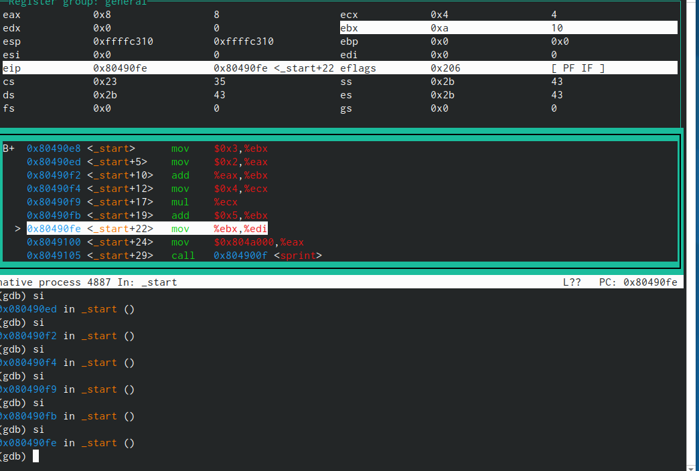{#fig:001 width=70%}

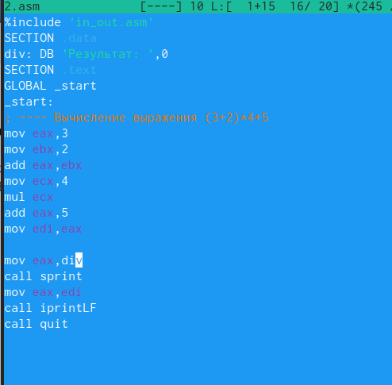{#fig:001 width=70%}

Текст программы:
%include 'in_out.asm'
SECTION .data
div: DB 'Результат: ',0
SECTION .text
GLOBAL _start
_start:
; ---- Вычисление выражения (3+2)*4+5
mov eax,3
mov ebx,2
add eax,ebx
mov ecx,4
mul ecx
add eax,5
mov edi,eax

mov eax,div
call sprint
mov eax,edi
call iprintLF
call quit

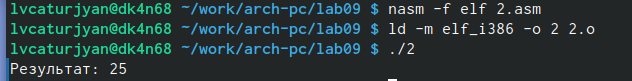{#fig:001 width=70%}

Программа работает корректно, результаты вычислений были проверены мной вручную

# Выводы
Я приобрёл навыки использования подпрограмм и работы с отладчиком
